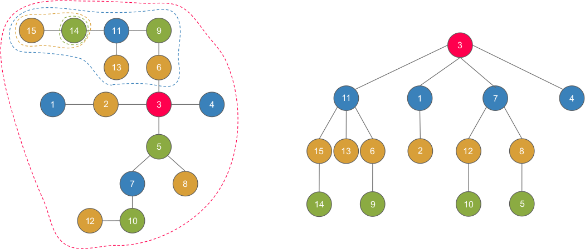

<h2>What is it?</h2>
Centroid decomposition is a divide and conquer method that decomposes and
balances trees so  that operations on it can be done in O(logn). It can
do this by repeatedly rooting the "centroid" of a   tree recursively.

A centroid is the node such that when removed, will split the tree into
subtrees such that each   subtree has size < N/2. It's gaurenteed that there
will be either one or two centroids, and if there   are two, they will be
next to each other.

What centroid decomposition does is first find the centroid of the tree,
then it removes it from the   rest of the tree, and finds the centroids of
the remaining subtrees. These centroids are then   removed and attatched
to the root, and this is done recursively. It can be seen that
since the   depth of the recursion is at most log(n), the final time
complexity is O(nlogn), since we do a dfs   at each level to find the
centroid.

It has some special properties:
> The tree formed contains all N nodes of the origonal tree

> The height of the tree is at most logn - since the subtree sizes of nodes
  will always at least half at each step (definition of centroid)

> Consider any two arbitrary vertices A and B and the path between them 
(in the original tree)   can be broken down into A-->C and C-->B where C 
is LCA of A and B in the centroid tree

The last statement is important. What its basically saying is that given
two nodes A and B,   if their LCA is C in the centroid decomposed
tree, then in the origonal tree, the path between   A and B
can be broken down into A->C and C->B. 

One might think: This is just a worse version of HLD, as its the same 
thing but you can't update   edge values. But, it's a lot
more light weight (less code), and can be used in situations that
HLD   may be challenging to implement.

Ex:
> Given a tree of "blue" nodes, you want to do the following queries:
>> Update a blue node to "red"  
>> Given a node, return the distance to the nearest red node, or -1

It also has other uses, since by virtue of its divide and conquer nature,
it reduces the number of   edges to consider from n^2 to nlogn. 
Example: IOI 2014 - Race: https://wcipeg.com/problem/ioi1112

